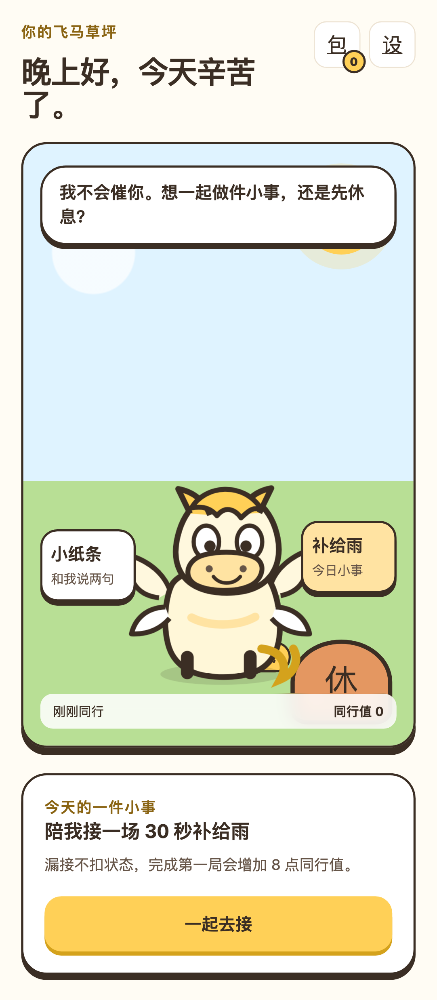

# 游戏与养成 Demo 吸收审计

日期：2026-08-28
范围：用户提供的 `牛马游戏和养成demo` 与 WingedHorse 草坪、掉落游戏、背包消耗闭环
目标：保留有留存价值的玩法反馈，去除与产品结构、安全边界和最终视觉规范冲突的实现

## 总体结论

Demo 已经证明“接住物品 → 入包 → 投喂/布置 → 角色反馈”比原项目的独立功能卡更接近可玩的养成产品。它的最大价值是即时反馈、场景内任务和角色响应；最大风险是前端碰撞即时发奖、持续重启麦克风、照片 Data URL 长期写入 localStorage，以及首页按钮过多、数值体系与问卷四维割裂。

本轮没有复制 Demo 的橙色 UI、Emoji 资产或高风险媒体实现，而是把交互骨架合并进现有暖金色设计系统和四维养成状态。

## Demo 的优点

1. 接物由角色直接参与，手指拖动、方向键和屏幕按钮都能形成明确操控感。
2. 倒计时、连击、难度增长、音效和结算共同构成一局完整节奏。
3. 掉落物不止是分数，会进入背包并用于投喂或布置，形成跨页面目标。
4. 气泡小任务把角色、现实行动、照片和奖励串成连续事件，而不是孤立菜单。
5. 家园能保留摆放结果，给用户“它在这里生活”的持续感。

## Demo 的缺点与处理

1. **奖励可信度不足**：每次碰撞立即修改 localStorage，可重复结算。本轮改为整局摘要一次性入包，并用 `sessionId` 防重复。
2. **时间与暂停不可靠**：原 Demo 混用定时器和动画循环。本轮使用场景运行帧的 `delta` 计时，暂停和切后台不会偷走游戏时间。
3. **隐私风险高**：语音模式会持续自动重启识别；照片以 Data URL 长期保存。本轮不吸收这两种实现，只保留已有的主动授权和端侧处理边界。
4. **养成体系割裂**：Demo 只有心情、能量，项目已有电量、发动机、疯感、导航仪。本轮继续使用项目四维，物品效果由领域规则计算。
5. **导航过载**：首页同时出现游戏、养成、背包、成就等同权重按钮。本轮改为单一草坪，游戏和对话由场景物件发起，其他操作进入角色互动 Sheet。
6. **角色依赖诱导风险**：部分等级和文案强调持续投喂。本轮同行值只增不减，不设置断签、离开惩罚或情感绑架。
7. **正式资产不足**：Demo 动画精灵与当前参考图不是批准的最终 2D 分层资产。本轮仅吸收动作节奏，不把该精灵表提交为正式资源。

## 当前流程验收

### Step 1：进入草坪 — 健康

角色是主视觉中心；补给雨、小纸条和休息区是场景入口；页面没有恢复成四栏导航或卡片门户。

### Step 2：查看今日小事 — 健康

首局任务说明奖励和无惩罚规则；完成后入口转为查看补给，不制造继续打卡压力。

### Step 3：开始补给雨 — 健康

有 3 秒准备、时间/得分/连击 HUD、触控与键盘说明；首帧和剩余时间进入 E2E 断言。

### Step 4：暂停与恢复 — 健康

暂停会停止场景更新，提供继续和安全退出；切换后台也会暂停，不丢失当前局。

### Step 5：结算入包 — 健康

结算展示最高连击与获得物品；同一个 `sessionId` 只会入包一次，空局不惩罚。

### Step 6：背包投喂 — 健康

使用前展示四维影响，稀有物品二次确认；使用后同步改变状态并增加少量同行值。

### Step 7：桌面响应式 — 健康

草坪与游戏保持受控宽度，没有横向溢出；桌面仍保留同一个生活现场。

## 仍需正式素材补齐的部分

- 游戏接取角色当前仍是运行时占位表现，最终应换成批准的 2D 角色跑动/接住动作。
- 场景帐篷、信箱、补给入口需要同一套原创矢量资产，不应以 Demo 的 Emoji 或生成素材直接充当终稿。
- 布置家园需要正式家具锚点、遮挡关系、撤销与跨设备持久化后再开放；本轮未复制 Demo 的任意位置摆放。

## 证据边界

截图可以确认层级、布局和可见状态；键盘语义、暂停计时、重复结算和状态变化由自动化测试验证。截图本身不能证明完整 WCAG 合规，也不能替代真人触控手感、低端安卓性能和最终角色资产验收。
