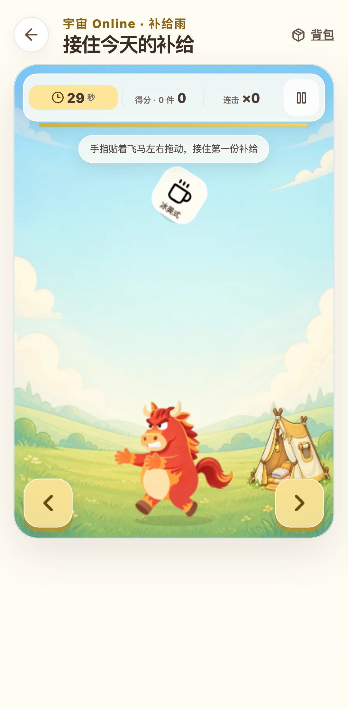
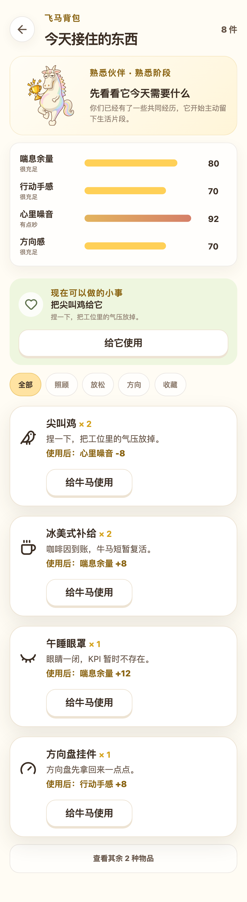
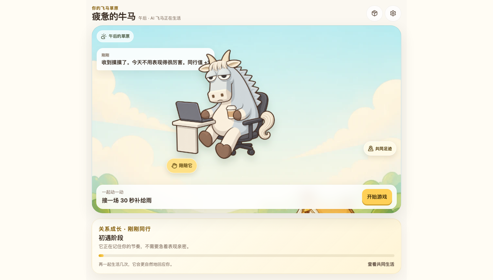
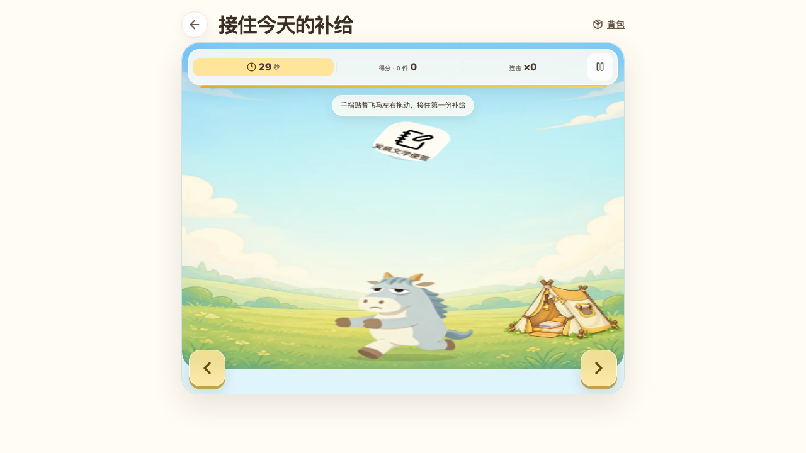
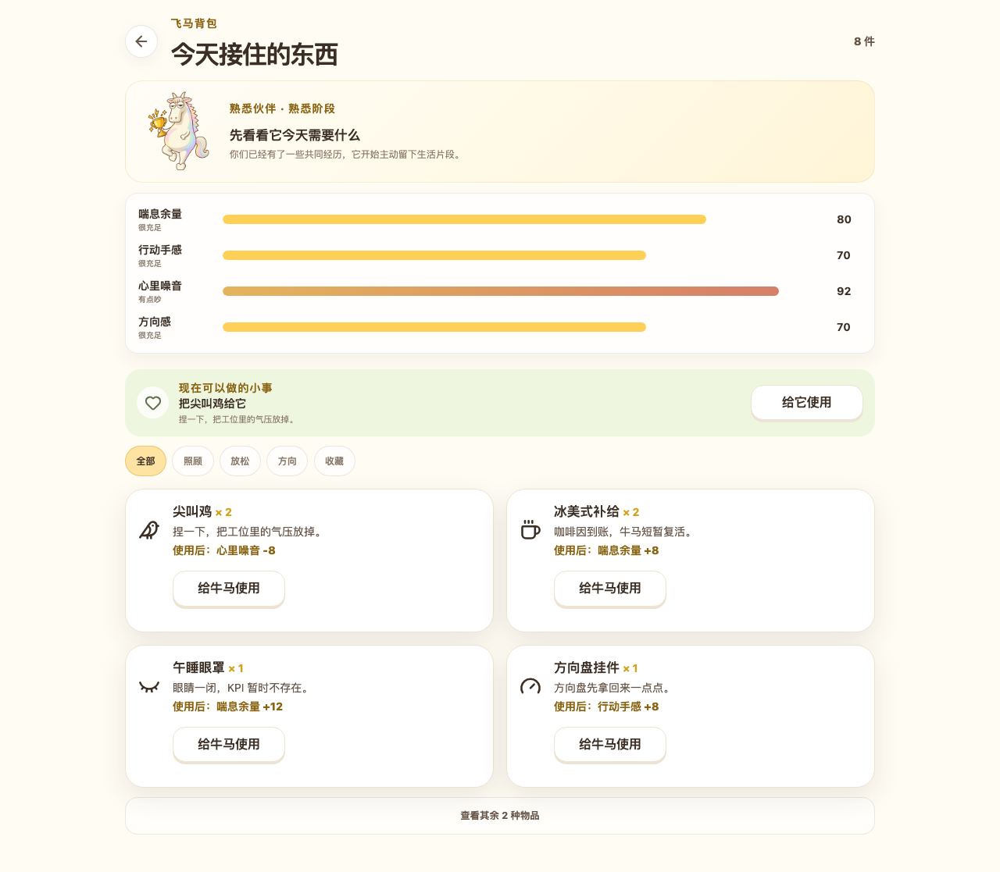

# 游戏与养成体验审计

日期：2026-08-28
范围：用户提供的 `牛马游戏和养成demo`、WingedHorse 草原/掉落游戏/背包/共同生活，以及公开竞品体验
目标：把独立功能串成可理解、可回应、可积累的养成关系，同时保留安全和反沉迷边界

## 总体结论

Demo 做得好的核心不是“入口更多”或“数值更多”，而是每次行为都能闭环：接住物品 → 入包 → 照顾角色 → 立即回应 → 留下变化。旧版 WingedHorse 虽然已有小游戏、背包、对话和信息流，但它们更像并列页面，用户不容易知道下一步，也不容易感到刚才的行为真的影响了角色。

本轮将产品收束为一条连续关系循环：**角色当前状态 → 场景内照顾 → 动作与文案回应 → 共同生活记录 → 情境化下一步**。没有复制 Demo 的橙色 UI、Emoji 资产或高风险媒体实现，而是把交互骨架合并进现有暖金色设计系统、2D 角色资产和四维养成状态。

## Demo 的优点

1. 接物由角色直接参与，手指拖动、方向键和屏幕按钮都能形成明确操控感。
2. 倒计时、连击、难度增长、音效和结算共同构成一局完整节奏。
3. 掉落物不止是分数，会进入背包并用于投喂或布置，形成跨页面目标。
4. 气泡小任务把角色、现实行动、照片和奖励串成连续事件，而不是孤立菜单。
5. 家园能保留摆放结果，给用户“它在这里生活”的持续感。
6. 任务和奖励都发生在同一个角色语境里，用户不需要先理解一套复杂系统。

## 竞品启发与边界

### Sowii / 秃秃

[Sowii 的 App Store 页面与用户评价](https://apps.apple.com/cn/app/sowii/id6752891135?platform=iphone&see-all=reviews)表明，可爱角色和新鲜感能促成首次体验，但公开评价中反复出现“互动太少”“希望能点击反馈、喂养和 AI 聊天”“希望保留更长时间生活回放”等诉求。这说明数字生命的短板通常不是少一个功能入口，而是缺少可见回应和可追溯的共同经历。

吸收：角色是首页主体；轻触即可照顾；反馈同时改变状态和生活记录；共同生活承接长期回看。

不复制：24 小时监控感、强依赖文案、用连续签到制造关系焦虑。

### Seedark

[Seedark 官方产品页](https://seedark.ai/zh)把体验组织为领养、查看当前状态、聊天/照顾/喂养/玩耍、再次返回同一只宠物。可借鉴的是身份、记忆和状态的一致性，而不是继续扩张一级导航。

吸收：所有入口使用同一个类型角色、同行值、成长阶段和生活事件；小游戏与背包不再是独立积分系统。

### PetPal AI

[PetPal AI 的 Google Play 页面](https://play.google.com/store/apps/details?hl=zh&id=com.Xreate.PetAI)覆盖照顾、聊天、动画、成长阶段、小游戏和奖励，验证了“玩法获得资源、资源推动照顾、照顾推动成长”的基本闭环。

吸收：明确成长阶段和即时角色动画；不吸收每日任务压力、付费诱导和无上限奖励堆叠。

## Demo 的缺点与处理

1. **奖励可信度不足**：每次碰撞立即修改 localStorage，可重复结算。本轮改为整局摘要一次性入包，并用 `sessionId` 防重复。
2. **时间与暂停不可靠**：原 Demo 混用定时器和动画循环。本轮使用场景运行帧的 `delta` 计时，暂停和切后台不会偷走游戏时间。
3. **隐私风险高**：语音模式会持续自动重启识别；照片以 Data URL 长期保存。本轮不吸收这两种实现，只保留已有的主动授权和端侧处理边界。
4. **养成体系割裂**：Demo 只有心情、能量，项目已有四维状态。本轮保留领域规则，但把界面翻译为“喘息余量、行动手感、心里噪音、方向感”，并补充自然语言状态，避免把角色做成仪表盘。
5. **导航过载**：首页同时出现游戏、养成、背包、成就等同权重按钮。本轮改为单一草原，游戏和对话由场景物件发起，其他操作进入角色互动 Sheet。
6. **角色依赖诱导风险**：部分等级和文案强调持续投喂。本轮同行值只增不减，不设置断签、离开惩罚或情感绑架。
7. **动作资产仍不完整**：小游戏已经接入 8 类游戏角色、天马结算图、统一草原和物品图标；草原互动暂时以轻量位移/缩放反馈实现。正式的触摸、进食、休息和情绪动作仍需后续分层资产。

## 本轮优化

1. 首页任务卡不再固定推荐“再玩一局”，而是按共同旅程自动指向游戏、背包、动态、纸条或朋友圈。
2. 新增初遇、熟悉、默契、并肩四段关系成长；只增不减，不断签、不降级，不用焦虑维持留存。
3. 角色互动 Sheet 可直接使用背包里的一份普通消耗品，不再强迫用户跳页；使用后立即显示角色回应并写入共同记录。
4. “摸摸它”的每日同行奖励按事件键去重，刷新页面也不能重复刷经验。
5. 背包先展示角色与今天的状态，再给出一件推荐小事；技术数值翻译成人能理解的感受，并按用途提供恢复、行动、解压、牛毛筛选。品牌合作物只归入牛毛；无物品的纪念分类不占移动端页签。
6. 小游戏统一为草原内的补给雨，补充角色惯性移动、掉落漂移、接住反馈、连击反馈、触控按钮和减少动态效果支持。
7. 游戏结算、背包消耗、同行值和生活动态使用同一份状态，消除“小游戏玩完但数字生命不知道”的割裂。
8. 背包推荐改为按当前四维缺口计算实际收益，不再机械选择第一件物品；推荐物品同时置顶，避免建议和列表脱节。
9. 默认只展示最相关的 4 种物品，其余内容由用户主动展开；单件操作收为次级按钮，降低手机端重复按钮造成的滚动和视觉噪音。
10. 草原照顾反馈在短暂动作与气泡回应后自动回到日常状态，再次照顾会重新触发动作，不让旧反馈永久覆盖数字生命正在发生的生活。

## 当前流程验收

### Step 1：进入草原 — 健康

角色是主视觉中心；补给雨、小纸条和休息区是场景入口；页面没有恢复成四栏导航或卡片门户。

### Step 2：看懂关系与下一步 — 健康

首页显示当前成长阶段、关系说明和下一次解锁提示；主 CTA 随旅程切换，不制造继续打卡压力。

### Step 3：开始补给雨 — 健康

有同场景引导和倒计时、时间/得分/连击 HUD、触控与键盘说明；首帧和剩余时间进入 E2E 断言。

### Step 4：暂停与恢复 — 健康

暂停会停止场景更新，提供继续和安全退出；切换后台也会暂停，不丢失当前局。

### Step 5：结算入包 — 健康

结算展示最高连击与获得物品；同一个 `sessionId` 只会入包一次，空局不惩罚。

### Step 6：场景内照顾与背包投喂 — 健康

普通补给可以在草原互动 Sheet 中直接使用；完整背包先显示角色需要和推荐行为。稀有物品仍二次确认；使用后同步改变状态、同行值和生活记录。

### Step 7：桌面响应式 — 健康

草原与游戏保持受控宽度，没有横向溢出；桌面仍保留同一个生活现场。

## 仍需正式素材补齐的部分

- 草原主角色仍需要同一比例的触摸、吃东西、休息、开心、低落动作，避免长期只靠缩放和位移表达反馈。
- 现有 8 类角色的画面留白和主体比例并不完全一致，下一轮出图应交付统一画布、安全区、脚底线和角色占比。
- 场景帐篷、信箱、补给入口需要同一套可商用原创资产和授权台账，不应以 Demo 的 Emoji 充当终稿。
- 布置家园需要正式家具锚点、遮挡关系、撤销与跨设备持久化后再开放；本轮未复制 Demo 的任意位置摆放。

## 证据边界

本轮截图来自当前代码的 Playwright 手机与桌面项目，可确认层级、布局和可见状态；键盘语义、暂停计时、重复结算、每日奖励去重和状态变化由自动化测试验证。截图不能证明完整 WCAG 合规，也不能替代真人触控手感、低端安卓性能、长期留存效果和最终角色资产验收。
